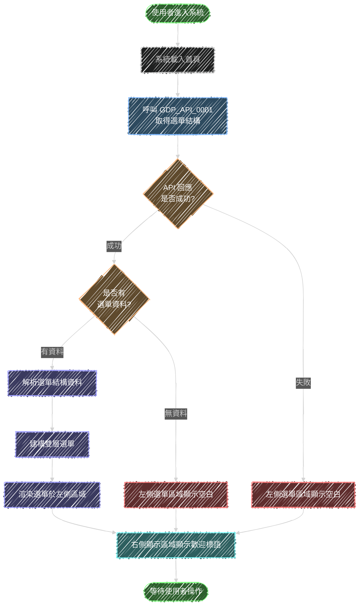

# 功能流程圖 GDP POC 系統

版本：001

## 1. 更新紀錄

| 日期       | 功能編號    | 調整API編號      | 說明                              |
| ---------- | ----------- | ---------------- | --------------------------------- |
| 2025-12-12 | GDP_FC_001  | GDP_API_0001     | 依據需求規格書[001]進行建立，新增讀取選單結構功能 |

## 2. 功能列表

| 功能編號    | 功能名稱        | 所屬頁面    |
| ----------- | --------------- | ----------- |
| GDP_FC_001  | 讀取選單結構    | GDP_UI_01   |

## 3. 功能說明

### 3.1 GDP_FC_001 讀取選單結構

- 功能名稱：讀取選單結構
- 功能目的：系統載入時自動取得站台選單結構資料，並於左側選單區域顯示雙層式選單
- 所屬頁面編號：GDP_UI_01

#### 使用 API 列表

| API編號      | API說明                  |
| ------------ | ------------------------ |
| GDP_API_0001 | 取得站台選單結構資料     |

#### 參數對應畫面欄位

**Request 參數**

| API編號      | Request參數 | 畫面欄位 |
| ------------ | ----------- | -------- |
| GDP_API_0001 | 無          | 無       |

**Response 參數**

| API編號      | Response參數  | 畫面欄位     |
| ------------ | ------------- | ------------ |
| GDP_API_0001 | menuGroups    | 選單群組列表 |
| GDP_API_0001 | menuId        | 選單識別碼   |
| GDP_API_0001 | menuName      | 選單名稱     |
| GDP_API_0001 | menuNo        | 選單排序編號 |
| GDP_API_0001 | pages         | 頁面列表     |
| GDP_API_0001 | pageId        | 頁面識別碼   |
| GDP_API_0001 | pageName      | 頁面名稱     |
| GDP_API_0001 | pageNo        | 頁面排序編號 |
| GDP_API_0001 | iframeId      | 內嵌頁面識別碼 |
| GDP_API_0001 | pageUrl       | 頁面網址     |

#### 流程圖

#### 流程說明

1. **使用者進入系統**：使用者開啟 GDP POC 系統
2. **系統載入首頁**：系統初始化並載入主框架（Header、左側選單區、右側顯示區）
3. **呼叫 GDP_API_0001**：自動呼叫後端 API 取得選單結構資料
4. **檢查 API 回應**：
   - 成功：進入資料檢查流程
   - 失敗（網路異常、服務無回應等）：左側選單區域顯示空白
5. **檢查是否有選單資料**：
   - 有資料：解析選單結構
   - 無資料：左側選單區域顯示空白
6. **解析選單結構資料**：解析 API 回傳的 JSON 格式選單資料
7. **建構雙層選單**：依據資料結構建構選單群組與頁面項目的層級關係
8. **渲染選單於左側區域**：將選單項目顯示於左側選單區域
9. **右側顯示區域顯示歡迎標語**：初始狀態顯示歡迎訊息
10. **等待使用者操作**：使用者可點選選單項目或點擊 Header 標題

#### 邊界值與異常處理

**邊界值考量**：
- 選單群組數量為 0：左側選單區域顯示空白
- 選單群組內頁面數量為 0：顯示選單群組但無子項目
- 頁面名稱過長：需考慮文字截斷或換行處理
- iframeId 與 pageUrl 同時存在：優先使用 iframeId（內嵌模式）
- iframeId 與 pageUrl 皆不存在：該頁面項目不可點選

**異常狀況處理**：
- API 連線逾時：左側選單區域保持空白，不顯示錯誤訊息
- API 回傳資料格式錯誤：左側選單區域保持空白
- 僅有 iframeId：使用內嵌模式顯示對應內容
- 僅有 pageUrl：使用 URL 導頁模式
- iframeId 與 pageUrl 皆無：該頁面項目顯示但不可點選
