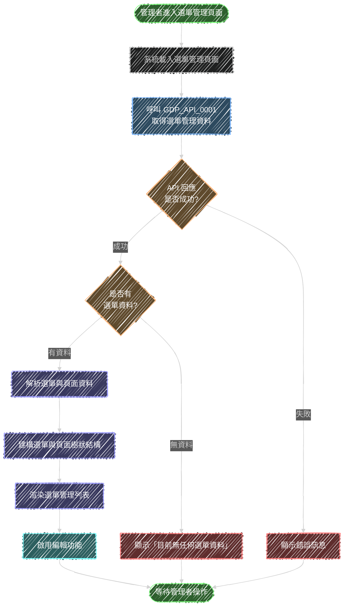
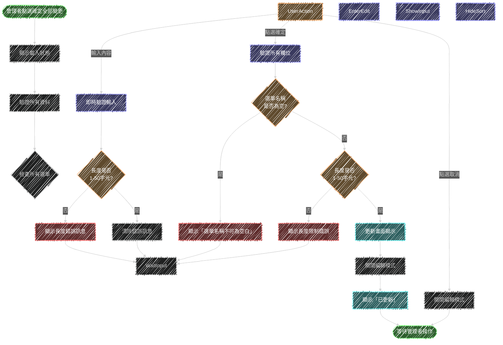

# 功能流程圖 GDP POC 系統

版本：003

## 1. 更新紀錄

| 日期       | 功能編號    | 調整API編號      | 說明                              |
| ---------- | ----------- | ---------------- | --------------------------------- |
| 2025-12-12 | GDP_FC_001  | GDP_API_0001     | 依據需求規格書[001]進行建立，新增讀取選單結構功能 |
| 2025-12-16 | GDP_FC_002 GDP_FC_003 | GDP_API_0001 GDP_API_0002 | 依據需求規格書[003]進行建立，新增選單管理功能，GDP_FC_002 與 GDP_FC_001 共用 GDP_API_0001。調整 API 參數為 snake_case 以對應資料表欄位 |

## 2. 功能列表

| 功能編號    | 功能名稱                  | 所屬頁面    |
| ----------- | ------------------------- | ----------- |
| GDP_FC_001  | 讀取選單結構              | GDP_UI_01   |
| GDP_FC_002  | 讀取選單管理資料          | GDP_UI_03   |
| GDP_FC_003  | 管理與確定選單結構變更    | GDP_UI_03   |

## 3. 功能說明

### 3.1 GDP_FC_001 讀取選單結構

- 功能名稱：讀取選單結構
- 功能目的：系統載入時自動取得站台選單結構資料，並於左側選單區域顯示雙層式選單
- 所屬頁面編號：GDP_UI_01

#### 使用 API 列表

| API編號      | API說明                  |
| ------------ | ------------------------ |
| GDP_API_0001 | 取得站台選單結構資料     |

#### 參數對應畫面欄位

**Request 參數**

| API編號      | Request參數 | 畫面欄位 |
| ------------ | ----------- | -------- |
| GDP_API_0001 | 無          | 無       |

**Response 參數**

| API編號      | Response參數  | 畫面欄位     |
| ------------ | ------------- | ------------ |
| GDP_API_0001 | menuGroups    | 選單群組列表 |
| GDP_API_0001 | menu_id       | 選單識別碼   |
| GDP_API_0001 | menu_name     | 選單名稱     |
| GDP_API_0001 | menu_no       | 選單排序編號 |
| GDP_API_0001 | pages         | 頁面列表     |
| GDP_API_0001 | page_id       | 頁面識別碼   |
| GDP_API_0001 | page_name     | 頁面名稱     |
| GDP_API_0001 | page_no       | 頁面排序編號 |
| GDP_API_0001 | menu_id       | 所屬選單識別碼 |
| GDP_API_0001 | dashboard_id  | 內嵌頁面識別碼 |
| GDP_API_0001 | url           | 頁面網址     |
| GDP_API_0001 | genie_id      | Genie識別碼  |

#### 流程圖

#### 流程說明

1. **使用者進入系統**：使用者開啟 GDP POC 系統
2. **系統載入首頁**：系統初始化並載入主框架（Header、左側選單區、右側顯示區）
3. **呼叫 GDP_API_0001**：自動呼叫後端 API 取得選單結構資料
4. **檢查 API 回應**：
   - 成功：進入資料檢查流程
   - 失敗（網路異常、服務無回應等）：左側選單區域顯示空白
5. **檢查是否有選單資料**：
   - 有資料：解析選單結構
   - 無資料：左側選單區域顯示空白
6. **解析選單結構資料**：解析 API 回傳的 JSON 格式選單資料
7. **建構雙層選單**：依據資料結構建構選單群組與頁面項目的層級關係
8. **渲染選單於左側區域**：將選單項目顯示於左側選單區域
9. **右側顯示區域顯示歡迎標語**：初始狀態顯示歡迎訊息
10. **等待使用者操作**：使用者可點選選單項目或點擊 Header 標題

#### 邊界值與異常處理

**邊界值考量**：
- 選單群組數量為 0：左側選單區域顯示空白
- 選單群組內頁面數量為 0：顯示選單群組但無子項目
- 頁面名稱過長：需考慮文字截斷或換行處理
- iframeId 與 pageUrl 同時存在：優先使用 iframeId（內嵌模式）
- iframeId 與 pageUrl 皆不存在：該頁面項目不可點選

**異常狀況處理**：
- API 連線逾時：左側選單區域保持空白，不顯示錯誤訊息

---

### 3.2 GDP_FC_002 讀取選單管理資料

- 功能名稱：讀取選單管理資料
- 功能目的：管理者進入選單管理頁面時，取得完整的選單與頁面結構資料供編輯使用
- 所屬頁面編號：GDP_UI_03

#### 使用 API 列表

| API編號      | API說明                          |
| ------------ | -------------------------------- |
| GDP_API_0001 | 取得站台選單結構資料（與 GDP_FC_001 共用） |

#### 參數對應畫面欄位

**Request 參數**

| API編號      | Request參數 | 畫面欄位 |
| ------------ | ----------- | -------- |
| GDP_API_0001 | 無          | 無       |

**Response 參數**

| API編號      | Response參數  | 畫面欄位         |
| ------------ | ------------- | ---------------- |
| GDP_API_0001 | menuGroups    | 選單群組列表     |
| GDP_API_0001 | menu_id       | 選單識別碼       |
| GDP_API_0001 | menu_name     | 選單名稱         |
| GDP_API_0001 | menu_no       | 選單排序編號     |
| GDP_API_0001 | pages         | 頁面列表         |
| GDP_API_0001 | page_id       | 頁面識別碼       |
| GDP_API_0001 | page_name     | 頁面名稱         |
| GDP_API_0001 | page_no       | 頁面排序編號     |
| GDP_API_0001 | menu_id       | 所屬選單識別碼   |
| GDP_API_0001 | dashboard_id  | 內嵌頁面識別碼   |
| GDP_API_0001 | url           | 頁面網址         |
| GDP_API_0001 | genie_id      | Genie識別碼      |

#### 流程圖

#### 流程說明

1. **管理者進入選單管理頁面**：管理者透過 URL（admin/menu-management）進入選單管理頁面
2. **系統載入選單管理頁面**：系統初始化並載入選單管理介面
3. **呼叫 GDP_API_0001**：自動呼叫後端 API 取得完整的選單與頁面管理資料（與 GDP_FC_001 共用同一 API）
4. **檢查 API 回應**：
   - 成功：進入資料檢查流程
   - 失敗：顯示錯誤訊息（「讀取選單資料失敗，請稍後再試」或其他具體錯誤）
5. **檢查是否有選單資料**：
   - 有資料：解析資料結構
   - 無資料：顯示「目前無任何選單資料」
6. **解析選單與頁面資料**：解析 API 回傳的 JSON 格式資料
7. **建構選單與頁面樹狀結構**：依據資料建立選單與其底下頁面的層級關係
8. **渲染選單管理列表**：將資料以樹狀結構顯示在頁面上
9. **啟用編輯功能**：顯示編輯、刪除、排序等操作按鈕
10. **等待管理者操作**：管理者可進行編輯、新增、刪除、排序等操作

#### 邊界值與異常處理

**邊界值考量**：
- 選單數量為 0：顯示「目前無任何選單資料」
- 選單底下頁面數量為 0：顯示選單但無子頁面項目

**異常狀況處理**：
- 網路連線異常：顯示「網路連線異常，請檢查網路後重試」
- 後端服務無回應：顯示「系統服務無回應，請聯繫系統管理員」
- 資料格式錯誤：顯示「資料格式錯誤，請聯繫系統管理員」

---

### 3.3 GDP_FC_003 管理與確定選單結構變更

- 功能名稱：管理與確定選單結構變更
- 功能目的：提供管理者在前端編輯選單與頁面資料，並統一批次送出所有變更至後端
- 所屬頁面編號：GDP_UI_03

#### 使用 API 列表

| API編號      | API說明                      |
| ------------ | ---------------------------- |
| GDP_API_0002 | 批次更新選單與頁面結構       |

#### 參數對應畫面欄位

**Request 參數**

| API編號      | Request參數   | 畫面欄位             |
| ------------ | ------------- | -------------------- |
| GDP_API_0002 | menuGroups    | 完整選單列表資料     |
| GDP_API_0002 | menu_id       | 選單識別碼           |
| GDP_API_0002 | menu_name     | 選單名稱             |
| GDP_API_0002 | menu_no       | 選單順序             |
| GDP_API_0002 | pages         | 頁面列表             |
| GDP_API_0002 | page_id       | 頁面識別碼           |
| GDP_API_0002 | page_name     | 頁面名稱             |
| GDP_API_0002 | page_no       | 頁面順序             |
| GDP_API_0002 | menu_id       | 所屬選單識別碼       |
| GDP_API_0002 | dashboard_id  | DASHBOARDID          |
| GDP_API_0002 | url           | URL                  |
| GDP_API_0002 | genie_id      | GENIEID              |

**Response 參數**

| API編號      | Response參數  | 畫面欄位         |
| ------------ | ------------- | ---------------- |
| GDP_API_0002 | success       | 批次更新成功狀態 |
| GDP_API_0002 | message       | 回應訊息         |

#### 流程圖

#### 流程說明

1. **管理者點選選單編輯按鈕**：點選特定選單列的編輯按鈕
2. **進入編輯模式**：該選單列進入編輯狀態
3. **選單名稱欄位變為輸入框**：將顯示文字切換為可編輯的輸入框
4. **隱藏上下移動按鈕**：編輯模式下不顯示排序按鈕
5. **等待管理者輸入**：管理者可進行編輯操作
6. **管理者操作**：
   - 輸入內容：即時驗證
   - 點選取消：放棄編輯並關閉編輯模式
   - 點選確定：進行完整驗證並送出
7. **即時驗證輸入**：檢查輸入長度是否符合 1-50 字元限制
8. **驗證所有欄位**：確定前檢查選單名稱是否為空白及長度限制
9. **更新畫面顯示**：將編輯後的資料更新至前端畫面（不呼叫後端）
10. **關閉編輯模式**：回到一般顯示模式
11. **顯示「已更新」訊息**：提示管理者畫面已更新，需點選「確定全部變更」才會送出至後端

#### 邊界值與異常處理

**邊界值考量**：
- 選單名稱最小長度：1 個字元
- 選單名稱最大長度：50 個字元
- 選單名稱為空白：顯示錯誤訊息

**異常狀況處理**：
- 選單名稱為空：顯示「選單名稱不可為空白」
- 選單名稱超過 50 字元：顯示「選單名稱長度不可超過 50 個字元」

---

### 3.4 GDP_FC_004 編輯頁面資料

- 功能名稱：編輯頁面資料
- 功能目的：提供管理者編輯頁面各項資訊的功能（僅前端操作，不呼叫後端 API）
- 所屬頁面編號：GDP_UI_03

#### 使用 API 列表

無需呼叫後端 API，此功能僅在前端更新畫面資訊。

#### 流程圖

#### 流程說明

1. **管理者點選頁面編輯按鈕**：點選特定頁面列的編輯按鈕
2. **進入編輯模式**：該頁面列進入編輯狀態
3. **所有欄位變為輸入框**：頁面名稱、DASHBOARDID、URL、GENIEID 都變為可編輯輸入框
4. **等待管理者輸入**：管理者可編輯各個欄位
5. **管理者操作**：
   - 輸入內容：即時驗證各欄位
   - 點選取消：放棄編輯並關閉編輯模式
   - 點選確定：進行完整驗證並更新畫面
7. **即時驗證輸入**：檢查各欄位長度限制
8. **驗證所有欄位**：確定前檢查頁面名稱是否為空白及所有欄位長度限制
9. **更新畫面顯示**：將編輯後的資料更新至前端畫面（不呼叫後端）
10. **關閉編輯模式**：回到一般顯示模式
11. **顯示「已更新」訊息**：提示管理者畫面已更新，需點選「確定全部變更」才會送出至後端

#### 邊界值與異常處理

**邊界值考量**：
- 頁面名稱：最小 1 字元，最大 50 字元，不可為空白
- DASHBOARDID：最小 0 字元，最大 200 字元，可為空白
- URL：最小 0 字元，最大 200 字元，可為空白
- GENIEID：最小 0 字元，最大 200 字元，可為空白

**異常狀況處理**：
- 頁面名稱為空：顯示「頁面名稱不可為空白」
- 頁面名稱超過 50 字元：顯示「頁面名稱長度不可超過 50 個字元」
- DASHBOARDID 超過 200 字元：顯示「DASHBOARDID 長度不可超過 200 個字元」
- URL 超過 200 字元：顯示「URL 長度不可超過 200 個字元」
- GENIEID 超過 200 字元：顯示「GENIEID 長度不可超過 200 個字元」

---

### 3.5 GDP_FC_005 確定選單結構變更

- 功能名稱：確定選單結構變更
- 功能目的：統一確定所有編輯後的選單與頁面資料並送出至後端保存
- 所屬頁面編號：GDP_UI_03

#### 使用 API 列表

| API編號      | API說明                      |
| ------------ | ---------------------------- |
| GDP_API_0005 | 批次更新選單與頁面結構       |

#### 參數對應畫面欄位

**Request 參數**

| API編號      | Request參數      | 畫面欄位             |
| ------------ | ---------------- | -------------------- |
| GDP_API_0005 | menuList         | 完整選單列表資料     |
| GDP_API_0005 | menuId           | 選單識別碼           |
| GDP_API_0005 | menuName         | 選單名稱             |
| GDP_API_0005 | menuOrder        | 選單順序             |
| GDP_API_0005 | pages            | 頁面列表             |
| GDP_API_0005 | pageId           | 頁面識別碼           |
| GDP_API_0005 | pageName         | 頁面名稱             |
| GDP_API_0005 | dashboardId      | DASHBOARDID          |
| GDP_API_0005 | url              | URL                  |
| GDP_API_0005 | genieId          | GENIEID              |
| GDP_API_0005 | pageOrder        | 頁面順序             |

**Response 參數**

| API編號      | Response參數  | 畫面欄位         |
| ------------ | ------------- | ---------------- |
| GDP_API_0005 | success       | 確定成功狀態     |
| GDP_API_0005 | message       | 回應訊息         |

#### 流程圖

#### 流程說明

1. **管理者點選確定全部變更**：點選工具列的「確定全部變更」按鈕
2. **顯示載入狀態**：顯示處理中的視覺回饋
3. **驗證所有資料**：開始驗證所有選單與頁面資料
4. **檢查所有選單**：逐一檢查每個選單項目
5. **驗證選單名稱**：檢查選單名稱是否為空白及長度限制
6. **檢查該選單底下頁面**：檢查該選單內的所有頁面
7. **驗證頁面資料**：檢查頁面名稱及其他欄位
8. **所有資料驗證通過**：確認所有資料符合規則
9. **呼叫 GDP_API_0002**：批次送出所有更新至後端
10. **檢查 API 回應**：確認批次更新是否成功
11. **呼叫 GDP_API_0001**：重新讀取最新的選單資料
12. **更新畫面顯示**：將最新資料更新至畫面
13. **隱藏載入狀態**：關閉處理中狀態
14. **顯示「變更已確定」**：提示管理者確定成功

#### 邊界值與異常處理

**邊界值考量**：
- 無任何選單資料：不執行確定動作
- 所有選單名稱都需符合 1-50 字元限制
- 所有頁面名稱都需符合 1-50 字元限制且不可為空白
- 所有 DASHBOARDID、URL、GENIEID 都需符合 0-200 字元限制

**異常狀況處理**：
- 資料驗證失敗：顯示具體驗證錯誤訊息（如「選單『XXX』名稱不可為空白」）
- 網路連線異常：顯示「網路連線異常，請檢查網路後重試」
- 後端服務無回應：顯示「系統服務無回應，請聯繫系統管理員」
- 批次更新失敗：顯示「確定失敗，請稍後再試」
- 部分更新成功：依後端回應顯示具體失敗項目
- API 回傳資料格式錯誤：左側選單區域保持空白
- 僅有 iframeId：使用內嵌模式顯示對應內容
- 僅有 pageUrl：使用 URL 導頁模式
- iframeId 與 pageUrl 皆無：該頁面項目顯示但不可點選
